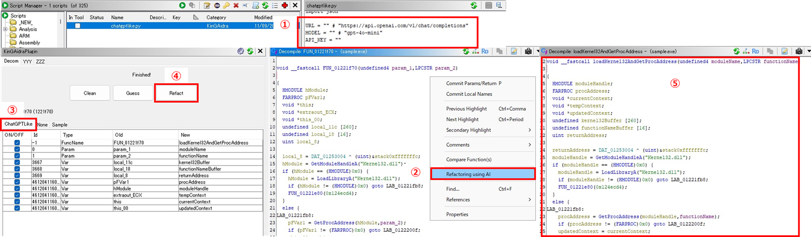

# KinGAidra
KinGAidra is a Ghidra extension that leverages AI to enhance reverse engineering tasks by modifying decompilation results. It provides tools for refactoring decompiled code, making it easier to modify.

