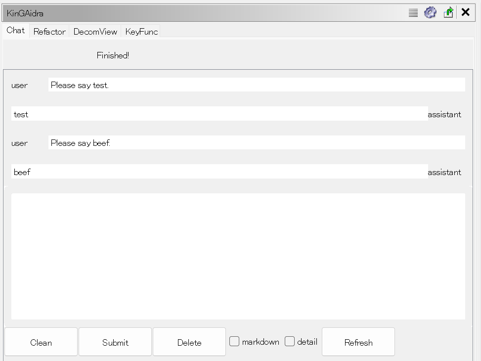
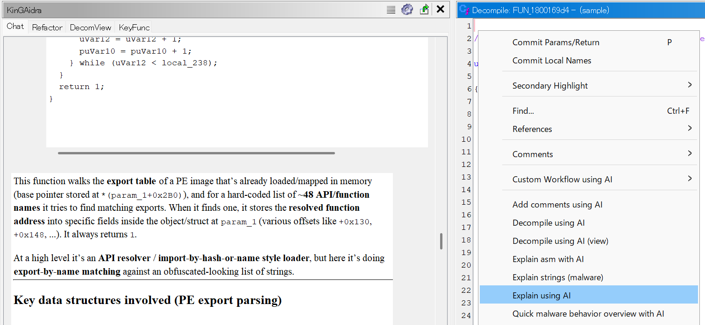
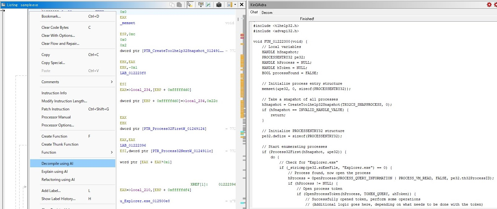
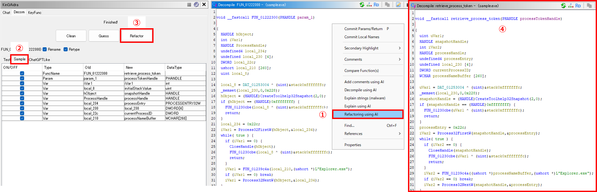
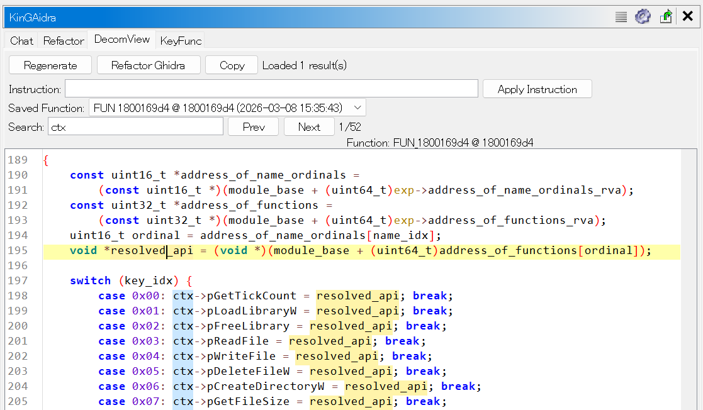
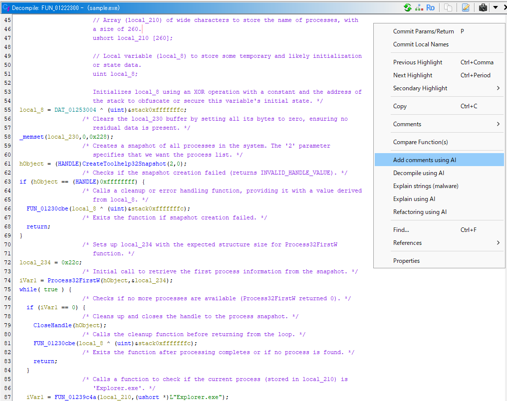
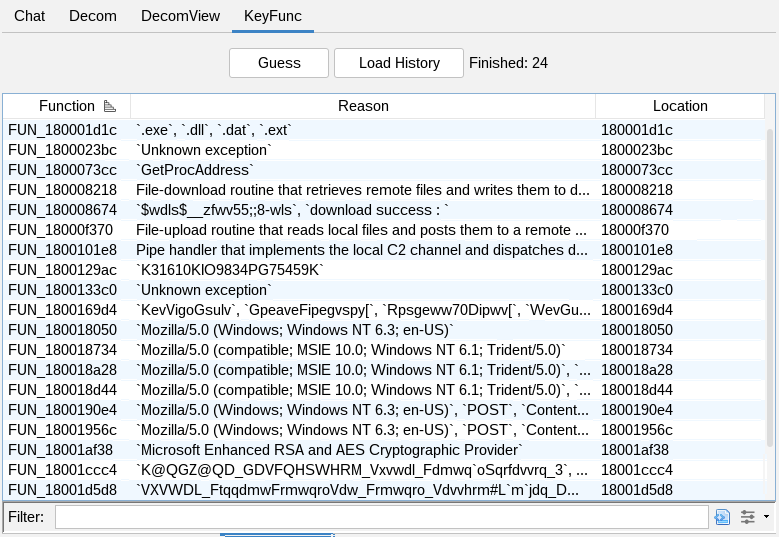
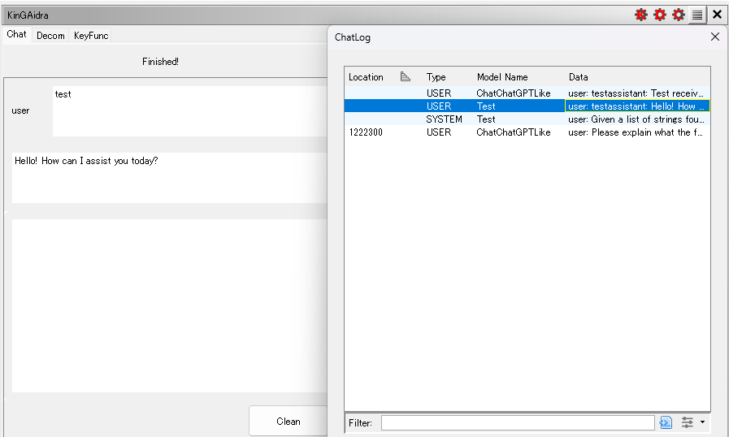

# KinGAidra

KinGAidra is a Ghidra extension that brings AI-assisted reverse engineering workflows directly into the Ghidra workspace.
It stores conversations and generated results per program, so you can reopen them later in Ghidra—and export the program to share the full conversation history with teammates.
It also supports repeatable actions in both the GUI and headless modes.

## What You Get

- **SOP-as-code:** define multi-step workflows as JSON and run them as UI actions.
- **Built-in traceability:** conversations and generated results are saved per program in and can be reopened directly in Ghidra (no external chat tools needed). Exporting the program also lets you share the conversation history together.
- **UI & headless parity:** run the same named actions/workflows via UI or headless.
- **Analyst-friendly navigation:** AI outputs can be rendered in Markdown and include clickable addresses to jump to relevant locations in Ghidra (Chat/DecomView/KeyFunc).
- **More than chat:** generate explanations, refactor suggestions, comments, key-function prioritization, and whole-program exports.

## Documentation

- [Installation Guide](./INSTALLATION.md)
- [Usage Guide](./USAGE.md)
- [Use Case Guide](./USE_CASES.md)

## Quick Start

1. Download extension ZIP from [releases](https://github.com/mooncat-greenpy/KinGAidra/releases).
2. Open Ghidra and enable `KinGAidra` in `File -> Install Extensions`, then restart.
3. In `Window -> Script Manager`, open a chat script (for example `kingaidra_chat.py`) and set required values such as `URL`, `MODEL`, and `API_KEY`, then save the script.
4. In KinGAidra config (gear icon), enable one model for Chat.
5. Right-click a function and run `Explain using AI`.
6. Open History and confirm the conversation was saved for the current program.

## Use Cases

For scenario-based walkthroughs with screenshots, see:

- [Use Case Guide](./USE_CASES.md)

## Core Features

### Chat

Ask free-form reverse engineering questions in Ghidra, then reuse the saved conversation later from the History view.

**Chat Example**



**Explain Decompiled Code**



**Decompile Assembly**



### Refactor

Generates rename/datatype proposals and can apply them to Ghidra.



### DecomView

- Generates LLM-based C view per function.
- Stores generated views in conversation history and supports regeneration/refactor.



### Commenting

- Generates comment suggestions and applies them to the current function.



### KeyFunc

- Prioritizes functions using chat-derived evidence.
- Can reload previously saved outputs from history.



### History

- History shows location, type, model, and timestamp.
- Selecting an entry restores the conversation in UI.



## Custom Workflow JSON

Configure:

`KinGAidra -> Prompts -> Chat -> Workflows -> Action Workflows (JSON)`

```json
[
  {
    "name": "IoCs",
    "system_prompt": "You are a senior malware analyst. Facts only.",
    "tasks": [
      "Summarize high-level behavior for <code> and include evidence addresses.",
      "List only high-confidence IOCs from <strings> with reasons."
    ]
  }
]
```

Behavior:

- Appears in popup: `Custom Workflow using AI -> <name>`
- Tasks run sequentially in one conversation
- Result is stored in project conversation history
- Same `name` can be executed in headless mode (`--action`)

## Headless Example

```bash
analyzeHeadless <PROJECT_DIR> <PROJECT_NAME> \
  -process <PROGRAM_NAME> \
  -postScript kingaidra_headless_chat.java \
  --action "Triage: Behavior + IOC" \
  --output workflow_result.md
```

More examples: [USAGE.md](./USAGE.md)

## FAQ

### Where is conversation history stored?

KinGAidra stores conversation records in the current program database table `KinGAidra_Conversation`.
When you switch program files, you see that program's own history.

### Can we define our own team workflow?

Yes. Define workflows as JSON in `KinGAidra -> Prompts -> Chat -> Workflows -> Action Workflows (JSON)`.
Each workflow appears as a popup action and can also be executed in headless mode.

### Can the same workflow run in CI or batch mode?

Yes. Use `kingaidra_headless_chat.java --action "<workflow name>"` to execute the same named action/workflow without GUI.

## License

KinGAidra is licensed under the Apache License 2.0.
See [KinGAidra/LICENSE](./KinGAidra/LICENSE) for the full license text and [KinGAidra/THIRD_PARTY_LICENSES.md](./KinGAidra/THIRD_PARTY_LICENSES.md) for bundled dependency licenses.
