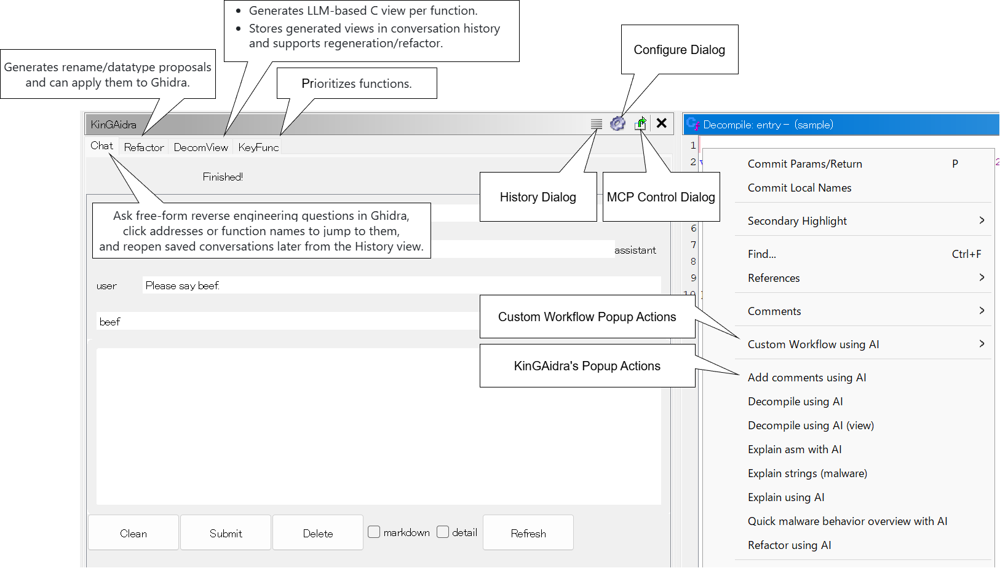
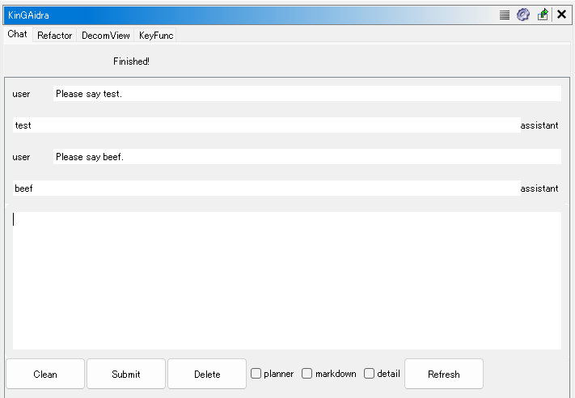
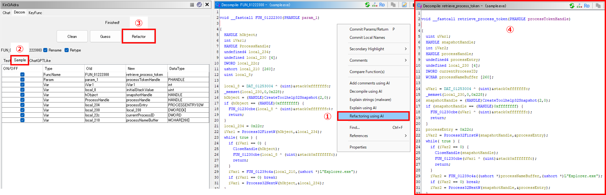
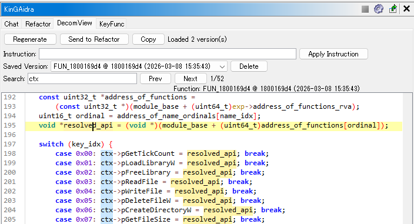
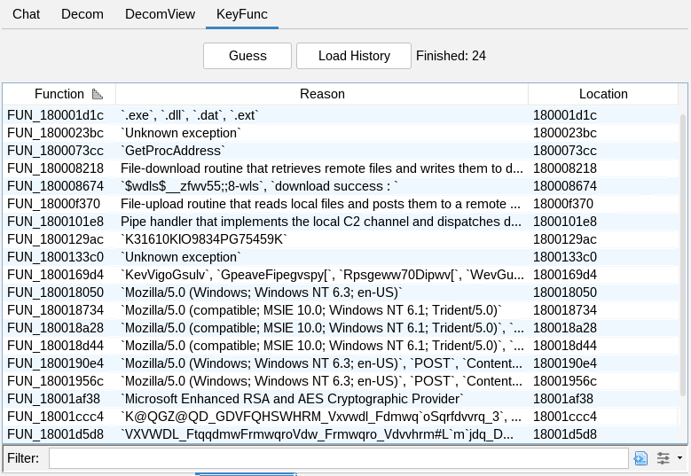
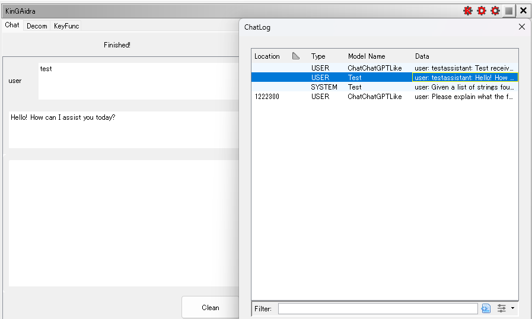
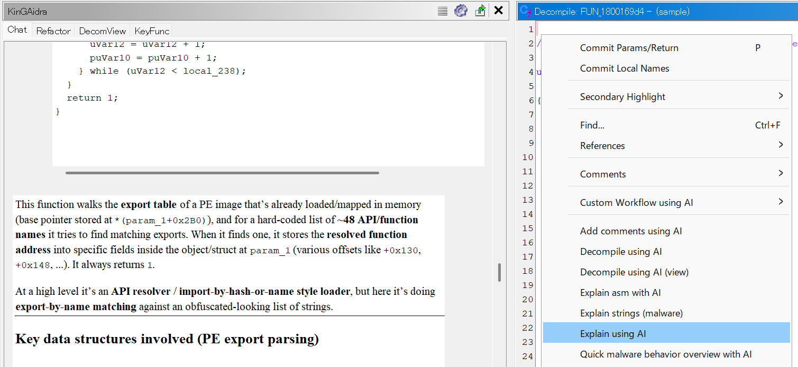
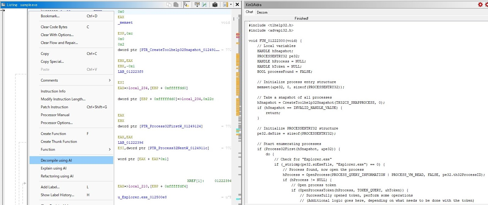
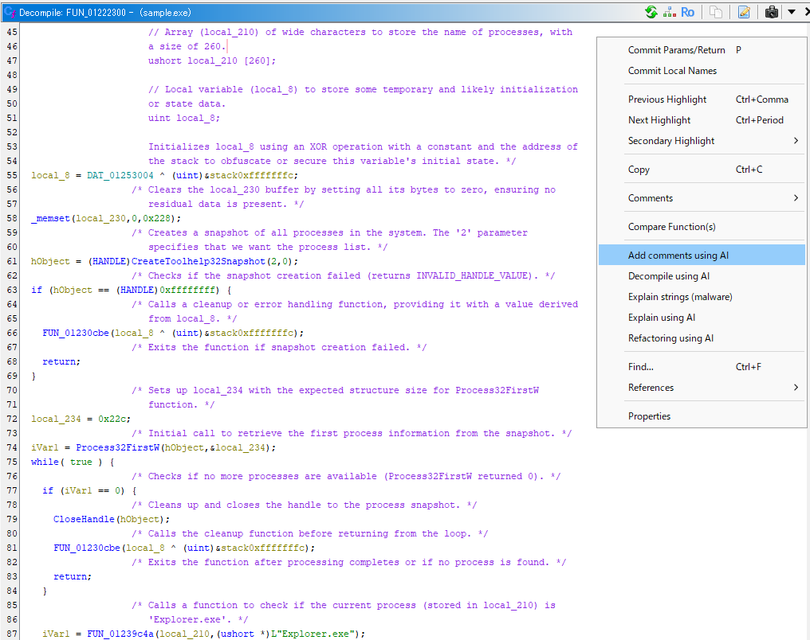

# KinGAidra

KinGAidra is a Ghidra extension that brings AI-assisted reverse engineering workflows directly into the Ghidra workspace.
It stores conversations and generated results per program, so you can reopen them later in Ghidra—and export the program to share the full conversation history with teammates.
It also supports repeatable actions in both the GUI and headless modes.

## What You Get

- **SOP-as-code:** define multi-step workflows as JSON and run them as UI actions.
- **Planner-assisted chat:** convert a free-form analysis request into executable workflow JSON on the fly from Chat.
- **Built-in traceability:** conversations and generated results are saved per program in and can be reopened directly in Ghidra (no external chat tools needed). Exporting the program also lets you share the conversation history together.
- **UI & headless parity:** run the same named actions/workflows via UI or headless.
- **Analyst-friendly navigation:** AI outputs can be rendered in Markdown and include clickable addresses to jump to relevant locations in Ghidra (Chat/DecomView/KeyFunc).
- **More than chat:** generate explanations, refactor suggestions, comments, key-function prioritization, and whole-program exports.

## Documentation

- [Installation Guide](./INSTALLATION.md)
- [Usage Guide](./USAGE.md)
- [Use Case Guide](./USE_CASES.md)
- [Local LLM](./LOCAL_LLM.md)

## Quick Start

1. Download extension ZIP from [releases](https://github.com/mooncat-greenpy/KinGAidra/releases).
2. Open Ghidra and add the ZIP downloaded in step 1 using the `Add extension` button in the upper-right corner of `File -> Install Extensions`.
3. Enable `KinGAidra` in `File -> Install Extensions`, then restart Ghidra.
4. If you are using Ghidra 12.1 or later, enable `Jython`.
5. In `Window -> Script Manager`, open a chat script (for example `kingaidra_chat.py`) and set required values such as `URL`, `MODEL`, and `API_KEY`, then save the script.
6. In KinGAidra config (gear icon), enable one model for Chat.
7. Right-click a function and run `Explain using AI`.
8. Open History and confirm the conversation was saved for the current program.

## Use Cases

For scenario-based walkthroughs with screenshots, see:

- [Use Case Guide](./USE_CASES.md)

## UI Overview

Quick overview of the main KinGAidra UI screens.



### Chat

Ask free-form reverse engineering questions in Ghidra, click addresses or function names to jump to them, and reopen saved conversations later from the History view. Enable `planner` to have KinGAidra first convert the current request into workflow JSON and then execute the planned workflow automatically.

**Chat Example**



### Refactor

Generates rename/datatype proposals and can apply them to Ghidra.



### DecomView

- Generates LLM-based C view per function.
- Stores generated views in conversation history and can send the current output to the Refactor tab for review/apply.



### KeyFunc

- Prioritizes functions using chat-derived evidence.
- Can reload previously saved outputs from history.



### History

- History shows location, type, model, and timestamp.
- Selecting an entry restores the conversation in UI.



### Popup Actions

**Explain Decompiled Code**



**Decompile Assembly**



**Generates comment and applies them to the current function**



## Custom Workflow JSON

Configure:

`KinGAidra -> Prompts -> Chat -> Workflows -> Action Workflows (JSON)`

```json
[
  {
    "name": "IoCs",
    "system_prompt": "You are a senior malware analyst. Facts only.",
    "tasks": [
      "Summarize high-level behavior for <code> and include evidence addresses.",
      "List only high-confidence IOCs from <strings> with reasons."
    ]
  }
]
```

Behavior:

- Appears in popup: `Custom Workflow using AI -> <name>`
- Tasks run sequentially in one conversation
- Result is stored in project conversation history
- Same `name` can be executed in headless mode (`--action`)

## Headless Example

```bash
analyzeHeadless <PROJECT_DIR> <PROJECT_NAME> \
  -process <PROGRAM_NAME> \
  -postScript kingaidra_headless_chat.java \
  --action "Quick malware behavior overview with AI" \
  --output workflow_result.md
```

More examples: [USAGE.md](./USAGE.md)

## FAQ

### Where is conversation history stored?

KinGAidra stores conversation records in the current program database table `KinGAidra_Conversation_V2`.
Older records may be migrated from `KinGAidra_Conversation` when they are opened.
When you switch program files, you see that program's own history.

### Can we define our own team workflow?

Yes. Define workflows as JSON in `KinGAidra -> Prompts -> Chat -> Workflows -> Action Workflows (JSON)`.
Each workflow appears as a popup action and can also be executed in headless mode.

### What is `planner` and how is it different from custom workflows?

`planner` is an on-demand workflow generator in the Chat tab.
Instead of selecting a pre-registered workflow, you describe the task in free-form text, KinGAidra converts it to workflow JSON, and then runs the first planned workflow immediately.
Custom workflows are better when you want a stable named action that also runs in headless mode.

### Can the same workflow run in CI or batch mode?

Yes. Use `kingaidra_headless_chat.java --action "<workflow name>"` to execute the same named action/workflow without GUI.

### Can we migrate conversation history from versions before 2.0.0?

If you want to keep conversation history created before KinGAidra 2.0.0, add the following entries to Ghidra's serial filter before opening the program.

Path: `Ghidra/Framework/FileSystem/data/kingaidra.serial.filter`

```text
kingaidra.ai.model.ModelByScript;
kingaidra.ai.model.ModelType;
java.lang.Enum;
kingaidra.ai.convo.Message;
java.util.ArrayList;
java.lang.Object;
java.util.LinkedHashMap;
java.util.HashMap;
java.util.Map$Entry;
java.lang.Long;
java.lang.Integer;
java.lang.Number;
```

Run Ghidra after adding the filter. Migrated history will be saved in the new format. New history does not require this setting.


## License

KinGAidra is licensed under the Apache License 2.0.
See [KinGAidra/LICENSE](./KinGAidra/LICENSE) for the full license text and [KinGAidra/THIRD_PARTY_LICENSES.md](./KinGAidra/THIRD_PARTY_LICENSES.md) for bundled dependency licenses.
