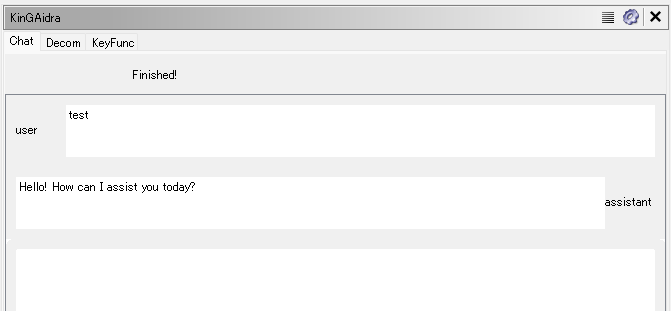
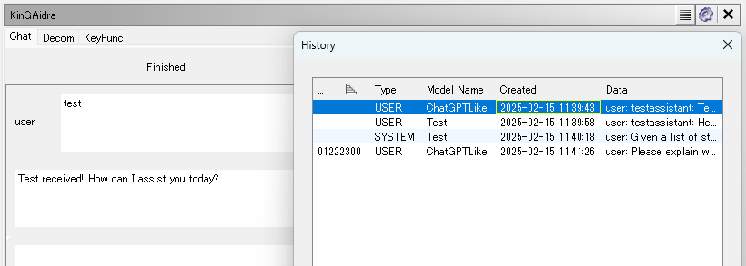

# KinGAidra Plugin

KinGAidra is a Ghidra extension designed to enhance reverse engineering workflows by integrating AI capabilities. It helps analysts understand binaries more efficiently.

## Features
- [**AI Chat for Assembly and Decompilation**](#Chat): Interact with AI to discuss and analyze binaries.
- [**AI-Assisted Refactoring**](#Refactoring): Automatically refactor decompiled code using AI-generated suggestions.
- [**AI-Assisted Commenting**](#Commenting): Automatically add comments to decompiled code using AI-generated suggestions.
- [**Key Function Identification**](#KeyFunc): Utilize AI to identify important functions in a binary for analysis.
- [**Chat Log**](#Log): Save chat logs for future reference or analysis.
- [**Customizable Models**](#Configuration): Employ various AI models to meet your specific needs.

### Chat

The Chat feature in KinGAidra allows users to interact with an AI to discuss and analyze binaries.

- Inputs enclosed in `<code>` or `<code:address>` tags will be converted into decompiled code.
- Inputs enclosed in `<asm>` or `<asm:address>` tags will be converted into assembly code.
- Inputs enclosed in `<strings>` tags will be converted into a list of strings.

**Chat Example**

**Explain Decompiled Code**

**Decompile Assembly**

### Refactoring

The Refactoring feature in KinGAidra enables users to automatically refactor decompiled code using AI-generated suggestions.

### Commenting

The Commenting feature in KinGAidra allows users to automatically add comments to decompiled code using AI-generated suggestions. This feature helps in understanding the code better by providing meaningful comments that explain the functionality of the code.

### KeyFunc

The KeyFunc feature in KinGAidra assists users in identifying and prioritizing key functions within a binary for analysis. This feature leverages AI to highlight functions of interest, allowing analysts to focus on critical parts of the code.

### Log

The Log feature in KinGAidra allows users to save chat logs for future reference or analysis. This can be particularly useful for tracking the progress of reverse engineering tasks, sharing insights with team members, or revisiting previous conversations to extract valuable information.

## Installation

To install KinGAidra, follow these steps:

1. **Download the latest release**: Visit the [KinGAidra releases page](https://github.com/mooncat-greenpy/KinGAidra/releases) and download the latest release zip file.
2. **Launch Ghidra**: Open Ghidra on your system.
3. **Install the extension**:
   - Navigate to `File -> Install Extensions`
   - Click on `Add extension`
   - Select the downloaded zip file
4. **Enable KinGAidra**: Check the checkbox next to `KinGAidra` to enable the extension.
5. **Restart Ghidra**: Restart Ghidra to apply the changes.

## Configuration

Before using KinGAidra, configure the script with your LLM API details:

1. **Open Script Manager**: In Ghidra, navigate to `Window -> Script Manager`.
2. **Edit the script**: Locate the `kingaidra_chat.py` script in the list and open it for editing.
3. **Set LLM API details**: Configure the following variables in the script with the correct values for your LLM API:
   - `URL`
   - `MODEL`
   - `API_KEY`

You can use the OpenAI API or similar APIs as the LLM API. For example, services like Groq or local LLMs can be used.

