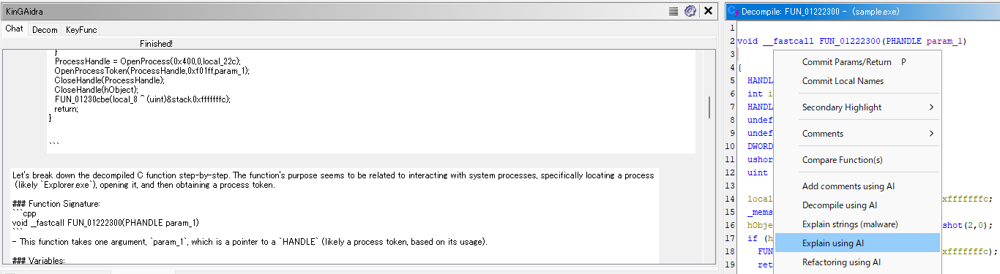

# KinGAidra Plugin

KinGAidra is a Ghidra extension that enhances reverse engineering workflows by integrating AI capabilities. It helps analysts understand binaries more efficiently.

## Features

- **AI Chat for Assembly and Decompilation**: Interact with AI to discuss and analyze binaries.
- **AI-Assisted Refactoring**: Automatically refactor decompiled code using AI-generated suggestions.
- **Customizable Models**: Use various AI models to meet your needs.

### Chat

The Chat feature in KinGAidra allows users to interact with an AI to discuss and analyze binaries.

Chat

Explain decompiled code

Decompile assembly

### Refactoring

The Refactoring feature in KinGAidra allows users to automatically refactor decompiled code using AI-generated suggestions.

