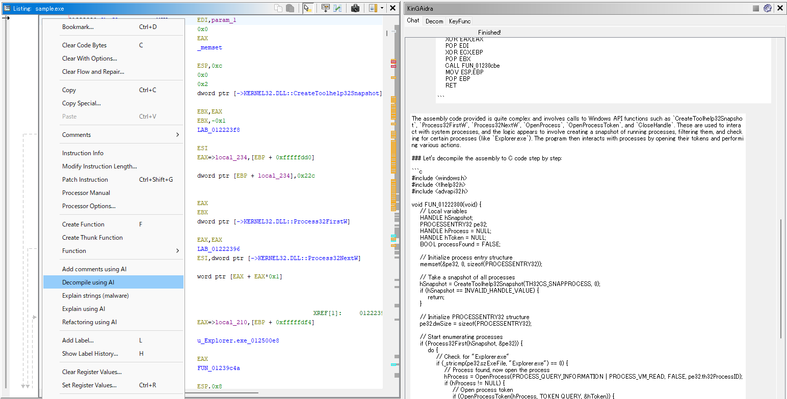
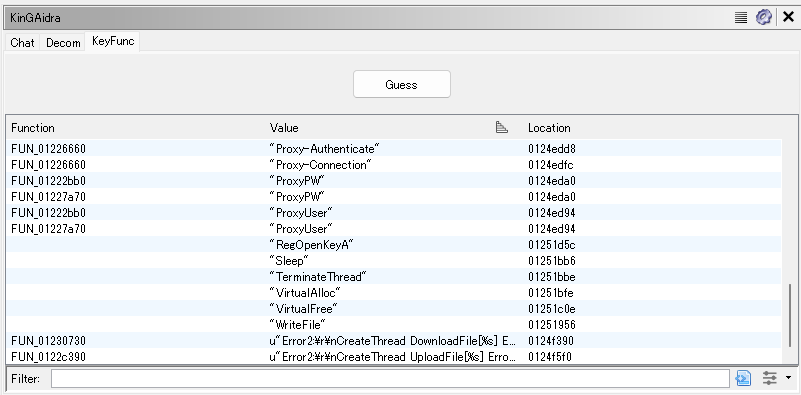
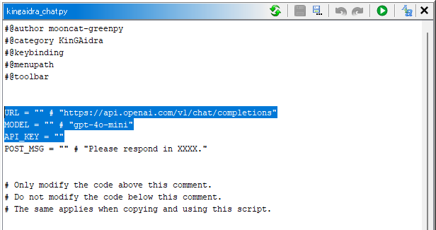

# KinGAidra Plugin

KinGAidra is a Ghidra extension designed to enhance reverse engineering workflows by integrating AI capabilities. It helps analysts understand binaries more efficiently.

## Features
- [**AI Chat for Assembly and Decompilation**](#Chat): Interact with AI to discuss and analyze binaries.
- [**AI-Assisted Refactoring**](#Refactoring): Automatically refactor decompiled code using AI-generated suggestions.
- [**AI-Assisted Commenting**](#Commenting): Automatically add comments to decompiled code using AI-generated suggestions.
- [**Key Function Identification**](#KeyFunc): Utilize AI to identify important functions in a binary for analysis.
- [**Chat History**](#History): Save chat logs for future reference or analysis.
- [**Customizable Models**](#Configuration): Employ various AI models to meet your specific needs.

### Chat

The Chat feature in KinGAidra allows users to interact with an AI to discuss and analyze binaries.

- Inputs enclosed in `<code>`, `<code:address>`, or `<code:address:recursive_count>` tags will be converted into decompiled code.
- Inputs enclosed in `<asm>`, `<asm:address>`, or `<asm:address:recursive_count>` tags will be converted into assembly code.
- Inputs enclosed in `<aasm>`, `<aasm:address>`, or `<aasm:address:recursive_count>` tags will be converted into assembly code with addresses.
- Inputs enclosed in `<strings>`, `<strings:index>`, or `<strings:index:count>` tags will be converted into a list of strings.
- Inputs enclosed in `<calltree>`, `<calltree:address>`, or `<calltree:address:depth>` tags will be converted into a call tree.

**Chat Example**

**Explain Decompiled Code**

**Decompile Assembly**

### Refactoring

The Refactoring feature in KinGAidra enables users to automatically refactor decompiled code using AI-generated suggestions.

### Commenting

The Commenting feature in KinGAidra allows users to automatically add comments to decompiled code using AI-generated suggestions. This feature helps in understanding the code better by providing meaningful comments that explain the functionality of the code.

### KeyFunc

The KeyFunc feature in KinGAidra assists users in identifying and prioritizing key functions within a binary for analysis. This feature leverages AI to highlight functions of interest, allowing analysts to focus on critical parts of the code.

### History

The History feature in KinGAidra allows users to save chat logs for future reference or analysis. This can be particularly useful for tracking the progress of reverse engineering tasks, sharing insights with team members, or revisiting previous conversations to extract valuable information.

## Scripts

Default scripts.

- `kingaidra_gen_copy_text.py`: Displays prompts with placeholders resolved, ready to copy into a UI such as ChatGPT.
- `kingaidra_auto.java`: Automatically analyzes multiple functions.
- `kingaidra_chat.py`: Provides a customizable interface for sending and receiving queries to LLMs within KinGAidra.

## Installation

To install KinGAidra, follow these steps:

1. **Download the latest release**: Visit the [KinGAidra releases page](https://github.com/mooncat-greenpy/KinGAidra/releases) and download the latest release zip file.
2. **Launch Ghidra**: Open Ghidra on your system.
3. **Install the extension**:
   - Navigate to `File -> Install Extensions`
   - Click on `Add extension`
   - Select the downloaded zip file
4. **Enable KinGAidra**: Check the checkbox next to `KinGAidra` to enable the extension.
5. **Restart Ghidra**: Restart Ghidra to apply the changes.

## Configuration

Before using KinGAidra, set up the `kingaidra_chat.py` script with your LLM API information:

1. **Open Script Manager**: In Ghidra, navigate to `Window -> Script Manager`.
2. **Edit the script**: Locate the `kingaidra_chat.py` script in the list and open it for editing.
3. **Set LLM API details**: Configure the following variables in the script with the correct values for your LLM API:
   - `URL`
   - `MODEL`
   - `API_KEY`

You can use the OpenAI API or similar APIs as the LLM API. For example, services like Groq or local LLMs are also supported. To change the language of the LLM response, modify the `POST_MSG` variable.

You can also copy `kingaidra_chat.py` and configure each copy with different API endpoints, models, or prompts. This allows you to switch between multiple LLMs or customize responses for different use cases. You can add scripts to KinGAidra through the settings screen shown in the image below. Additionally, you can select which scripts to use for which functions.

## Usage: without API key
This section describes how to use KinGAidra when you don't have an API key (e.g., for the OpenAI API).
Most of KinGAidra's features (AI chat, refactoring, commenting, and key function identification) require an LLM API.
Without an API key, use this workflow with a web UI such as ChatGPT.

### Analyzing a code
Use placeholders to extract assembly or decompiled code that you can paste into a web UI.
You can also recursively include the specified function and the functions it calls.
For the placeholder syntax, see [Chat](#Chat).

1. Open the KinGAidra configuration (gear icon) and enable only `CopyTextGen` (`kingaidra_gen_copy_text.py`).

2. In the Chat tab, enter `<code:FUN_401000:1>` (the decompiled code of `FUN_401000` and the functions it calls) and click **Submit**.

3. The decompiled code will be shown—copy it.

4. In ChatGPT (or another web UI), write your instructions and paste the decompiled code.
The screenshots below show an example prompt, pasted code, and the response.

### Exporting and analyzing the whole program
Export the assembly and/or decompiled code for all functions, compress it into a ZIP file, and attach it to a web UI.

1. Run `kingaidra_export.py` from the Script Manager (or similar).

2. A directory (e.g., `sample_exported/`) will be created in the current working directory where you executed `ghidraRun`. Zip the generated directory.

3. Attach the zipped file to ChatGPT (or another web UI) and write your instructions.
The screenshots below show an example of attaching the ZIP and giving instructions.

