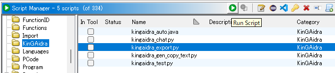
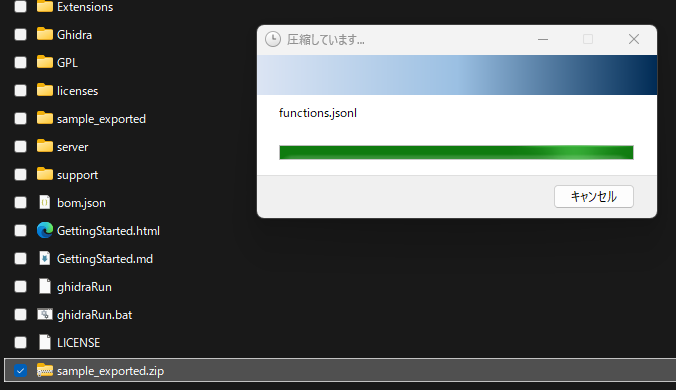
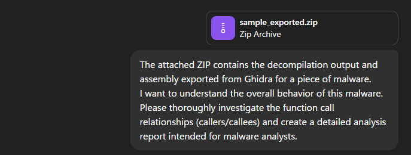
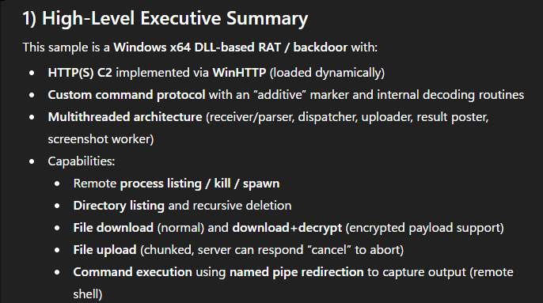

# Usage Guide

This guide explains usage.

- KinGAidra stores generated conversations in the current Ghidra program database.
- History is project-scoped: when you switch program files, you see the history for that program.

## Chat Tab

Use Chat for free-form prompts.

### Placeholder syntax

Placeholders in prompts are resolved against the current program:

- `<code>`, `<code:address>`, `<code:address:recursive_count>`: decompiled code
- `<asm>`, `<asm:address>`, `<asm:address:recursive_count>`: assembly code
- `<aasm>`, `<aasm:address>`, `<aasm:address:recursive_count>`: assembly code with addresses
- `<strings>`, `<strings:index>`, `<strings:index:count>`: list of strings
- `<calltree>`, `<calltree:address>`, `<calltree:address:depth>`: call tree

Notes:

- `address` accepts function name or hex address text.
- Numeric placeholder arguments are parsed as hex values.

### Typical flow

1. Select an active model in KinGAidra configuration.
2. Open `Chat` tab.
3. Enter prompt (with placeholders if needed).
4. Click `Submit`.
5. Open `History` to revisit or reload past conversations.

### Chat controls and interactions

- `Clean`: reset current conversation view.
- `Delete`: delete currently loaded conversation from history.
- `Refresh`: rebuild chat rendering while keeping current input text.
- `markdown` checkbox: switch message rendering between plain text and markdown/html rendering.
- `tool` checkbox: hide/show tool-result/tool-call messages.
- In markdown mode, single-click `0x...` token to jump to address.
- In markdown mode, single-click identifier token to jump to the first matching function.
- Some loaded history conversations are read-only: input is locked and `Submit` is disabled.

## Popup Actions (Right Click)

KinGAidra adds actions directly from code locations:

- `Explain using AI`
- `Explain asm with AI`
- `Decompile using AI`
- `Explain strings (malware)`
- `Quick malware behavior overview with AI`
- `Add comments using AI`
- `Refactoring using AI`
- `Decompile using AI (view)`
- `Custom Workflow using AI -> <workflow name>` (if configured)

## Decom Tab (Refactoring)

`Decom` proposes function/parameter/variable rename and datatype improvements.

1. Move cursor to a function.
2. Run `Refactoring using AI` (popup), or open `Decom` and click `Guess`.
3. Review proposals.
4. Apply refactor in Ghidra.

Additional operations:

- `Clean` clears current diff tabs and state.
- `Refactor` applies only the currently selected model tab.
- Per-row `ON/OFF` checkbox controls whether each rename/retype candidate is applied.
- Diff table cells (`New`, `DataType`) are editable before applying.
- `Rename` checkbox enables/disables renaming application.
- `Retype` checkbox enables/disables datatype replacement for params/locals.
- `Resolve datatype` checkbox enables/disables struct/datatype resolution pass.

## DecomView Tab

`DecomView` generates LLM-based C output per function and keeps per-function results.

1. Move cursor to a function.
2. Run `Decompile using AI (view)`.
3. Optionally provide additional instruction and click `Apply Instruction`.
4. Optionally click `Refactor Ghidra` to apply from generated view.
5. Use `Saved Function` selector to browse stored results.

Additional operations:

- `Regenerate` reruns decompile-view generation for the selected/current function.
- `Copy` copies the currently shown generated C text to clipboard.
- `Saved Function` entries include update timestamp and load most recent saved output per function.
- `Search` supports interactive match highlighting with `Prev`/`Next` and Enter key navigation.
- Caret/selection symbol highlighting is supported in the code view.
- Double-clicking an identifier in generated code jumps to matching function entry.
- `Apply Instruction` can be triggered by pressing Enter in the instruction field.

## KeyFunc Tab

`KeyFunc` prioritizes functions for reverse engineering based on chat outputs.

1. Open `KeyFunc`.
2. Click `Guess` to generate function priorities.
3. Click `Load History` to reload previously saved KeyFunc outputs.

Additional operations:

- Results are shown in a navigable table (`Function`, `Reason`, `Location`).
- Clicking table rows supports navigation to function location.
- Filter panel can narrow displayed rows.
- Saved KeyFunc history is auto-loaded when the tab is initialized.

## Toolbar Actions

- `Configure` (toolbar): open model configuration table.
- `History` (toolbar): open conversation log table dialog.
- `MCP Control` (toolbar): open MCP server control dialog (`Start` / `Stop`, status, port).

### Configure Dialog

- Edit model script path per model.
- Toggle model enabled/disabled status per model group.
- `Add Column`: add model name + script entry.
- `Delete Column`: remove selected model entry.

### History Dialog

- Select a row to load a past conversation into Chat view.
- Some system-generated history views are read-only in Chat.
- History table includes columns: `Location`, `Type`, `Model Name`, `Created`, `Data`.
- History table filter supports narrowing rows.
- Deleting a loaded conversation is done from Chat `Delete` button.

### MCP Control Dialog

- `Status` shows `Running` or `Stopped`.
- `Port` shows the current MCP server port (`-` if unavailable).
- `Start` starts the MCP server.
- `Stop` stops the MCP server.
- If `Start` is pressed while already running, an "already running" message is shown.
- If `Stop` is pressed while already stopped, a "not running" message is shown.
- Status/port are refreshed automatically while the dialog is open.
- Closing the dialog does not stop the MCP server (only UI refresh stops).

## Prompt and Workflow Options

Editable options are exposed in Tool options:

- `KinGAidra -> Prompts -> Default System Prompt`
- `KinGAidra -> Prompts -> Chat/Decom/DecomView/KeyFunc/...` task prompts
- `KinGAidra -> Prompts -> Chat -> Workflows -> Action Workflows (JSON)`
- Workflow popup actions are refreshed when workflow JSON changes.

## Headless Usage

Script: `kingaidra_headless_chat.java`

### Action mode

```bash
analyzeHeadless <PROJECT_DIR> <PROJECT_NAME> \
  -import <BINARY_PATH> \
  -postScript kingaidra_headless_chat.java \
  --action "Quick malware behavior overview with AI" \
  --output result.md
```

### Question mode

```bash
analyzeHeadless <PROJECT_DIR> <PROJECT_NAME> \
  -process <PROGRAM_NAME> \
  -postScript kingaidra_headless_chat.java \
  --question "Summarize behavior and list evidence addresses." \
  --output answer.md
```

### Workflow mode

If `--action` matches a configured custom workflow name, that workflow is executed.

### Options

- `-a`, `--action`
- `-q`, `--question`
- `-o`, `--output`
- `--model-script`
- `-h`, `--help`

Additional behavior:

- If `--output` is omitted, output defaults to `<program_name>_kingaidra_headless_chat.md`.
- Positional free text (without `--question`) is treated as question text.
- Action aliases accepted: `Explain with AI` and `Decompile with AI` (in addition to popup labels).
- `--model-script` overrides configured active model. Without it, current active Chat model is used.
- Output directory is auto-created if it does not exist.

## Custom Workflow JSON

This scenario demonstrates the same workflow in GUI and headless mode.

1. Define workflow JSON in:
`KinGAidra -> Prompts -> Chat -> Workflows -> Action Workflows (JSON)`
2. Example workflow name: `IoCs`.
3. In Code Browser popup menu, run:
`Custom Workflow using AI -> IoCs`.
4. Open History and verify the workflow conversation was saved.
5. Run headless with the same action name:

```bash
analyzeHeadless <PROJECT_DIR> <PROJECT_NAME> \
  -process <PROGRAM_NAME> \
  -postScript kingaidra_headless_chat.java \
  --action "IoCs" \
  --output workflow_result.md
```

6. Compare GUI output and `workflow_result.md` for consistency in workflow intent.

## MCP Script (`kingaidra_mcp.py`)

Runtime operation:

- Starts MCP HTTP server for the current program.
- Script args: `[port]` or `[host port]`; if omitted/invalid, free port is auto-selected.
- Published URL format: `http://<host>:<port>/mcp`.
- Tool option `KinGAidra -> MCP -> Auto-start MCP server` controls auto-start on program open.

Exposed MCP tools:

- `get_current_address`
- `get_function_address_by_name`
- `get_function_list`
- `get_callee_function`
- `get_caller_function`
- `get_asm_by_address`
- `get_asm`
- `get_decompiled_code_by_address`
- `get_decompiled_code`
- `refactoring`
- `add_comments`
- `get_strings`
- `get_imports`
- `get_exports`
- `get_ref_to`
- `get_bytes`
- `search_asm`
- `search_decom`
- `run_script`
- `search_bytes`
- `get_datatype`
- `create_datatype_from_c_source`

## Usage Without API Key

### Placeholder Copy Workflow (`kingaidra_gen_copy_text.py`)

If you cannot call APIs directly, use the copy-text workflow:

1. Enable only `CopyTextGen` (`kingaidra_gen_copy_text.py`).
2. Generate context text via placeholders in Chat.
3. Copy output into your external web UI prompt.

### Full Program Export Workflow (`kingaidra_export.py`)

For full-program context export, run:

```text
kingaidra_export.py <OUT_DIR> [--hexdump]
```

Export includes decompile/asm/strings/imports/exports/function metadata/call edges (and optional segment hexdumps).

1. Run `kingaidra_export.py`.



2. Zip the generated export directory.



3. Upload the ZIP to your web UI and ask for analysis.




