# Use Case Guide

This guide covers practical analyst workflows in KinGAidra.

## Use Case 1: Identify Which Samples to Analyze First

Goal:
Run `Quick malware behavior overview with AI` on multiple samples, review markdown reports, pick targets, then jump to reported functions in GUI.

### Steps

1. Prepare a sample list file (`samples.txt`) with one binary path per line.
2. Run headless overview for each sample and save markdown output.

```bash
mkdir -p reports
while IFS= read -r sample; do
  base="$(basename "$sample")"
  out="reports/${base}.md"
  analyzeHeadless <PROJECT_DIR> <PROJECT_NAME> \
    -import "$sample" \
    -postScript kingaidra_headless_chat.java \
    --action "Quick malware behavior overview with AI" \
    --output "$out"
done < samples.txt
```

3. Open markdown reports in `reports/` and shortlist samples for deeper analysis.

Markdown report review for triage:

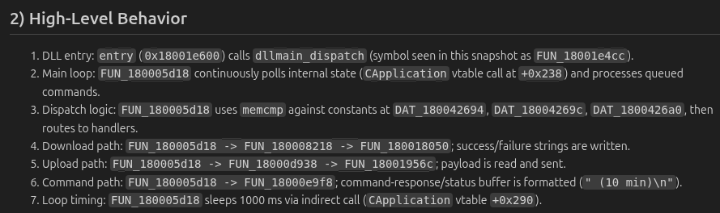

4. Open a shortlisted sample in Ghidra GUI.
5. Open `History` and select the conversation.
6. In Chat view, enable `markdown`, then click reported addresses (for example `0x...`) or function names to jump.

Clickable markdown address and jump target in Code Browser:

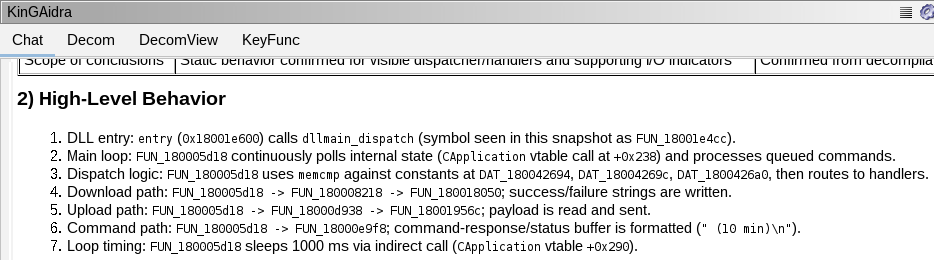

### Result

- Fast triage across multiple samples via headless markdown.
- Immediate function-level navigation in GUI for shortlisted targets.

---

## Use Case 2: Detect Dynamic API Loading with a Repeatable Workflow

Goal:
Define a workflow for dynamic API loading analysis, run it, then inspect both final output and tool execution traces.

### Steps

1. Open:
`KinGAidra -> Prompts -> Chat -> Workflows -> Action Workflows (JSON)`
2. Set a workflow such as the following:

```json
[
  {
    "name": "Dynamic API Resolution Analyst",
    "system_prompt": "Identify code in the binary on Ghidra that 'dynamically resolves and calls APIs.' Actively search the assembly and decompiled code using `search_decom` / `search_asm`. Perform a thorough search while considering various techniques for dynamically resolving APIs. Also, take into account that variable names and strings may not be properly set, and search for byte patterns and offsets as well.",
    "tasks": [
      "Investigate whether techniques using APIs such as GetProcAddress are present.",
      "Investigate whether techniques using special assembly instructions such as syscalls are present.",
      "Investigate whether there is processing that obtains the addresses of the PE or PEB, and whether these structures are parsed.",
      "Summarize the resolution method(s) and list the functions that execute them."
    ]
  }
]
```

Workflow JSON configuration screen:

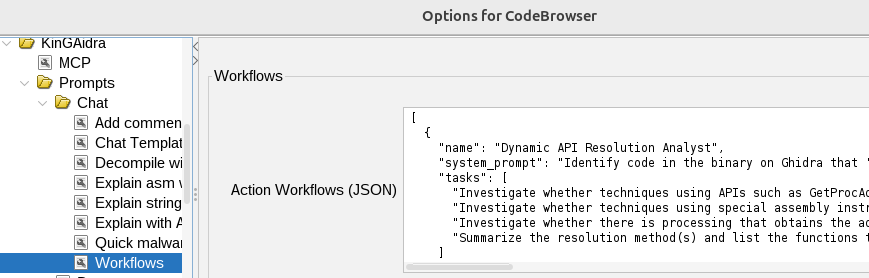

3. Run popup action:
`Custom Workflow using AI -> Dynamic API Loading Hunt`

Popup action selection:

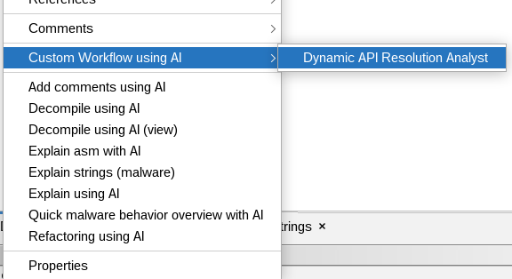

4. In Chat view:
   - Enable `markdown` to read the report and click addresses.
   - Enable `tool` to display tool call/result messages.

Chat output with markdown and tool traces:

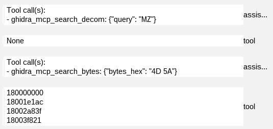

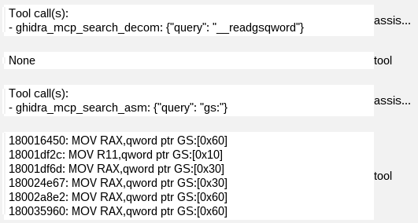

### Result

- Workflow-based dynamic API loading report.
- Tool call/result visibility for deeper validation.

---

## Use Case 3: Make Decompiled Output Easier to Read and Apply It to Ghidra

Goal:
Generate DecomView output, improve it with instructions, and apply refactor changes to Ghidra decompile state.

### Steps

1. Move cursor to a target function.
2. Run `Decompile using AI (view)` from popup.

Initial DecomView output:

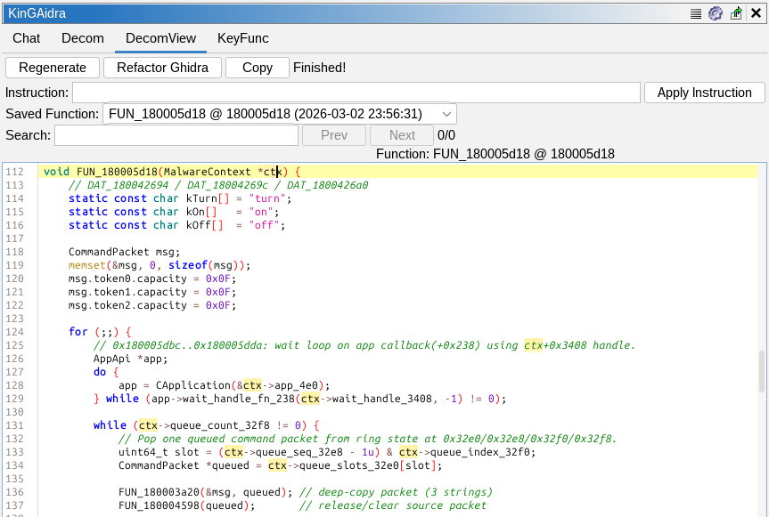

3. In DecomView tab, review generated output.

Improved DecomView before additional instruction:

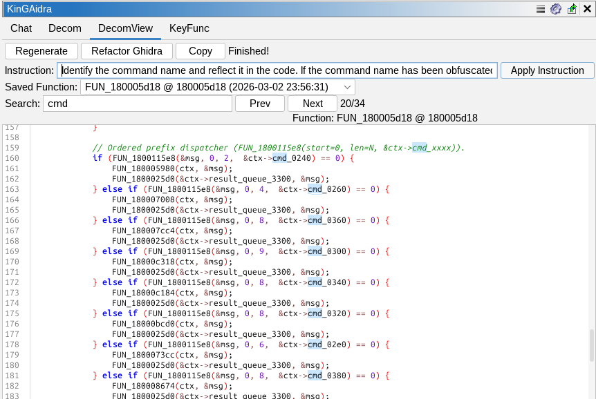

4. Add additional instruction and run `Apply Instruction`.

Improved DecomView after additional instruction:

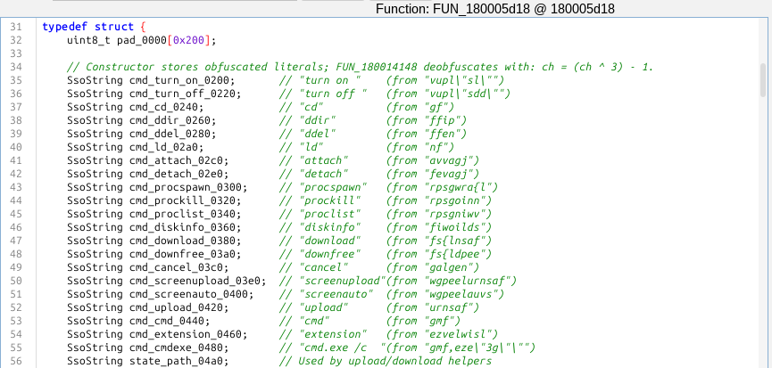

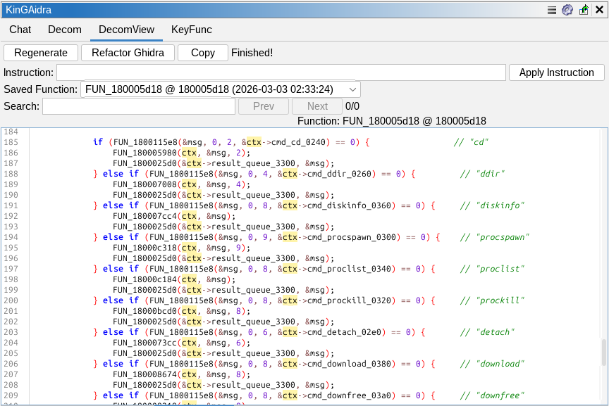


5. Apply changes with `Refactor Ghidra`.
6. Check updated function names/types in the standard Ghidra decompiler.

Refactor result in Ghidra decompiler:

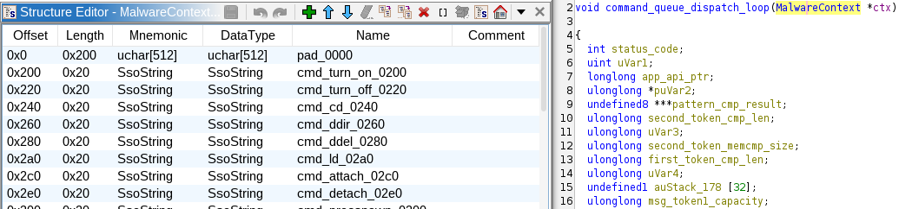

### Result

- Iteratively improved decompile view.
- Refactor updates propagated into Ghidra analysis state.

---

## Use Case 4: Keep and Reuse AI Explanations Across Reopen and Export/Import

Goal:
Run `Explain using AI`, verify history persistence after reopen, then verify again after exporting/importing as `.gzf`.

### Steps

1. On a target function, run popup action `Explain using AI`.
2. Confirm output in Chat.

Explain output in Chat:

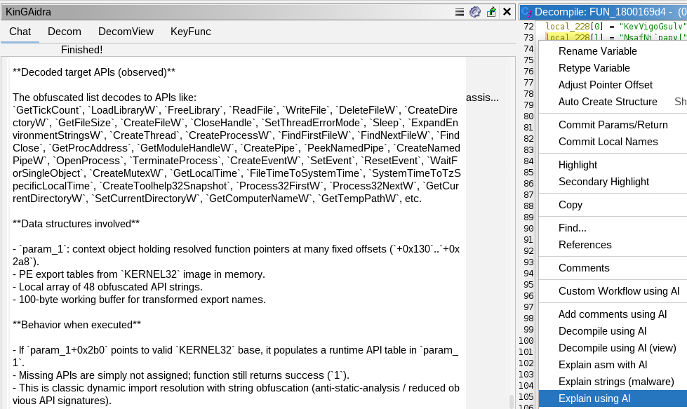

3. Open `History` and confirm the conversation entry.
4. Close the program and reopen it, then check `History` again for the same conversation.

History view after reopening:

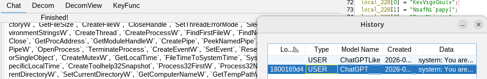

5. Export program as Ghidra Zip (`.gzf`) from Ghidra export flow.
6. Import the exported `.gzf` into Ghidra.
7. Open imported program and verify the same conversation in `History`.

History view after GZF import:

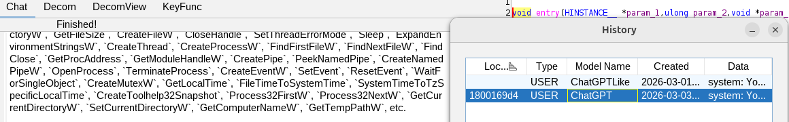

### Result

- Conversation is recoverable after reopen.
- Conversation remains available after `.gzf` export/import.

---

## Use Case 5: Find Important Functions Quickly and Jump to Them

Goal:
Generate prioritized function list with KeyFunc and navigate directly to selected functions.

### Steps

1. Open `KeyFunc` tab.
2. Click `Guess` to enumerate/prioritize functions.

KeyFunc ranked result list:


3. Review listed reasons and locations.
4. Select a row in KeyFunc table to navigate to the corresponding function location.

Jumped function location from KeyFunc selection:

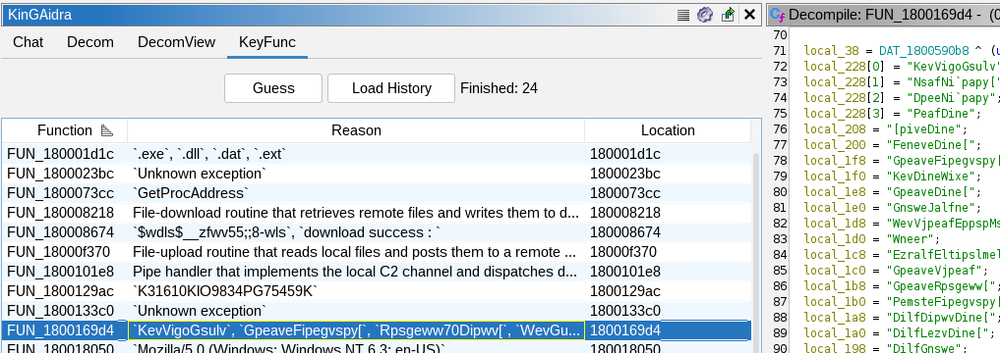

5. Use `Load History` to reload previously saved KeyFunc results.

### Result

- Prioritized function candidates for analysis.
- One-click navigation from KeyFunc results to code locations.
